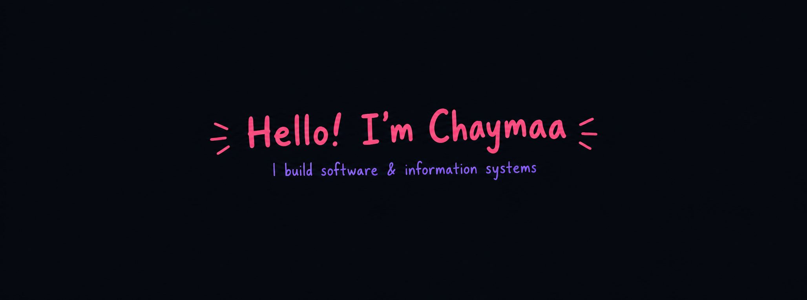

  

 

I'm a passionate **Software Engineering** student and developer from Morocco 🇲🇦

**About me**

* 🎓 Master's student / Bac+5 in **Software Engineering & Information Systems Management**
* 💻 Interested in **Software Engineering, Web Development & Information Systems**
* 🚀 Currently building and improving full-stack applications, including an **ERP Distribution System**
* 🧩 Interested in **software architecture, database design, APIs and business applications**
* 🛠️ Experienced with technologies across **Frontend, Backend, Databases and SAP/ABAP**
* 📚 Always learning and improving my development skills

**Technologies & Tools**

<code></code> <code></code> <code></code> <code></code> <code></code> <code></code> <code></code> <code></code> <code></code> <code></code> <code></code> <code></code>

**Software Engineering**

* Software Architecture
* Information Systems
* Database Design
* REST APIs
* MVC
* UML & Merise
* Agile / Scrum
* Testing & Maintenance
* CRUD Applications
* ERP / Business Applications

**SAP & ABAP**

* SAP ERP
* ABAP Programming
* SAP HANA
* Data Dictionary (DDIC)
* ALV Reports
* SQL / Open SQL
* FI / MM / SD / CO fundamentals
* SAP Fiori fundamentals

 

#### Top Repositories

 
 

-->
